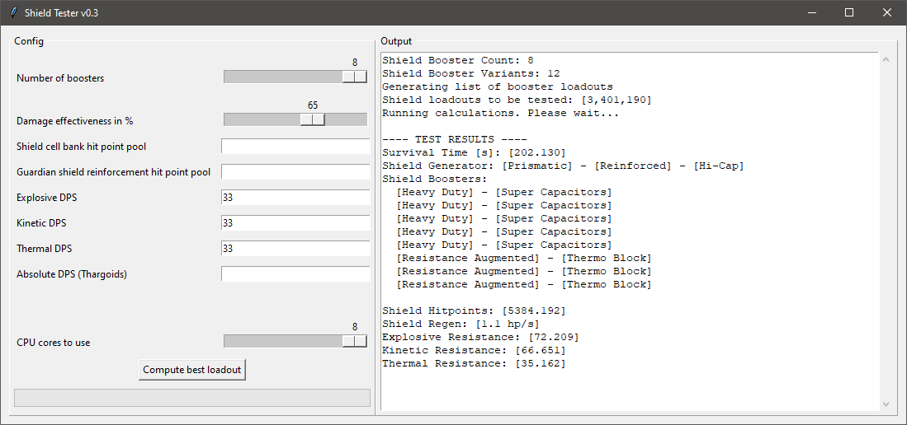

# Shield Tester (Python Version)

This is an implementation in Python 3 of [Down to Earth Astronomy's](https://github.com/DownToEarthAstronomy/D2EA_Shield_tester) Power Shell script.\
You can find pre-compiled executables at [Thurion's Fork](https://github.com/Thurion/D2EA_Shield_tester/releases) if you don't want to run it from source.

The goal of this project is to simulate the best possible shield setup for the configured scenario in the game Elite: Dangerous.

## Python program specifics

For some reason multi-core computation might be slower when using the executable instead running from source.
This has an impact on the time it takes to run a simulation, therefore it might be better to run tests with up to 4 shield boosters on just 1 core.
The difference isn't huge but noticeable. Just test it and choose whatever works best for you.