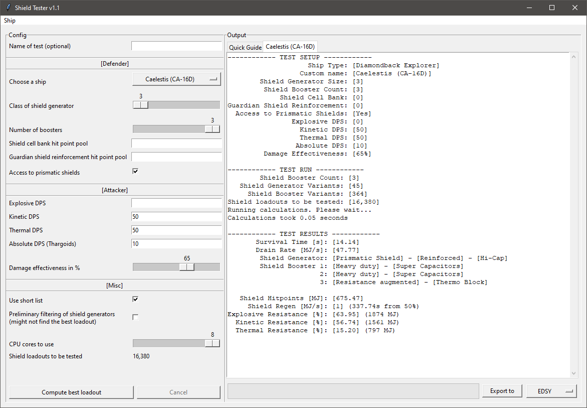

# Shield Tester (Python Version)
This is an implementation in Python 3 of [Down to Earth Astronomy's](https://github.com/DownToEarthAstronomy/D2EA_Shield_tester) Power Shell script.

You can find pre-compiled executables at [Thurion's Fork](https://github.com/Thurion/D2EA_Shield_tester/releases) if you don't want to run it from source. Feel free to open an issue for bugs or feature requests for the Python version over there.

## Requirements when running from source
* Required
  * [Python 3.7+](https://www.python.org/downloads) 
  * Tkinter (is bundled in installer for Windows and MacOs)
* Optional
  * Python modules (run `pip install <module name>`)
     * "psutil" to set priority of child processes to below normal 

## Abstract
Many of us run many different ships, with many stored shield generators and modules with many forms of engineering. It might be tempting to just put on Heavy Duty / Deep plating, but is that really the best alternative? How do you choose the best loadout? 

Before D2EA's shield tester tool, it was the usual metas, which undeniably work. However, there's so many combinations, it's hard to say for sure if the meta for your ship and combat or defence scenario is the best alternative. 

We need a way of figuring out the best combination of generator and shield boosters for situational scenarios. For example, you might want to change between mining to fighting Thargoid Interceptors or NPCs in combat zones. All of three scenarios require slightly different loadouts. 

### Why a Python version? 
tl;dr: Speed. Nothing else. The other versions work just fine. 

The original Powershell version is groundbreaking research, but is fairly slow, and thus might discourage some from running the tool when they change ships or combat scenarios. 

The multi-threaded Python port is many times faster per CPU thread. It might not be as fast as the Go version but it's fast enough to run any amount of shield boosters within a reasonable time.

### Improvements to these tools
In a [comment](https://www.youtube.com/watch?v=87DMWz8IeEE&lc=Ugz-fl387Mi0ePTFCZ94AaABAg) to the original D2EA video, Cmdr Kaethena listed a few limitations and scenarios that you should read to understand that these tools are a good starting point, but possibly not the ending point for your shield loadouts. There are a lot of situations where a more generalist loadout might help you more than a max survivability loadout from this tool. YMMV. 

## How to use

### Name of test

It is possible to give the test run a name. This will determine the name of the log file and tab in the interface. All tests with the same chosen name will be written into the same file. If no name is specified, the testes ship name followed by the current time stamp will be used (i.e. Anaconda 2019-11-16 23.04.23.txt).\
Because this affects the file name and not every character is allowed for a file name, only letters, numbers, and `,`, `.`, `_`, `-` including spaces are permitted. 

### Defender
This section describes settings related to the defending ship.

#### Class of shield generator
In case you don't want to fit the biggest possible shield and go for a smaller one, select a different class (classes are 1 - 8). The rating will always be A or C for bi-weaves.\
However, only shield classes that can actually be fitted can be selected. The interface handles this automatically.

#### Number of boosters
Choose between 0 and the maximum your ship can use (max 8) to fill up those utility slots. Like with the class for the shield generator, the porgram automatically won't let you choose invalid setups.

#### Shield cell bank (SCBs) hitpoint pool
If you have SCBs, include their regen hitpoints here. Keep in mind that you can only use one at a time. Which means that if the fight is too short, you won't be able to use all SCBs. And don't forget that they will increase your heat by a lot which is not simulated by this tool.

#### Guardian shield reinforcement hitpoint pool
If you have Guardian Shield Reinforcement Packages, include their combined hitpoints here. 

#### Access to prismatic shields
There is a checkbox you can uncheck if you don't want prismatic shields to be taken into consideration when running tests.

### Attacker
This section describes settings related to the attacking ship.

#### Damage per second
These are expressed in incoming damage per second per type. It is not easy to come up with meaningful values. One thing you could do is to plan a ship on Coriolis and plug those DPS stats into the tool.

#### Damage effectiveness
Damage effectiveness is the percentage of time you'll be taking fire. Something like a PvP Commander who is using turrets might
be able to hit you say 65% of the time. A Cmdr using fixed plasma or rail weapons will hit you may be 10% of the time, allowing 
you to regenerate your shields between hits. Obviously the latter really hurt, so ... really up that DPS when you lower this score.

### Misc
This section describes some settings that affect performance of the calculations.

#### Use short list
The short list contains only 12 instead of 20 items. That makes the calculations much faster with the disadvantage of not having any explosive resistance focused boosters taken into account.

#### CPU cores to use
Using more cores can speed up the program by a considerable amount.

#### Preliminary filtering of shield generators
Check this when you want the program to search for the best possible shield generators before running the time intensive calculations. This can have a huge impact on runtime with the disadvantage of not always finding the best possible loadout.

#### Buttons
When you are ready to go, press `Compute best loadout`. As soon as the calculations start, the `Cancel` button will become available. This can be really helpful in case you started a test with almost 100 million loadouts on just 1 core.

Once the results become available, you can press the `Export to Coriolis` button to export the test result's ship loadout if your current tab to Coriolis. The shield generator will always be fitted into the highest class slot even if you chose a smaller one. Just drag and drop it on Coriolis where you want to have it. The internal modules will be non-engineered default ones.\
Import from Coriolis is not available at this time.

### Output
Each unique name of a test run will have its own tab but the output will be cleared when a new test is started with the same name. You will have all your results in the log files in case you need to look up something.\
When you don't fill in a name, the tab name will be the same as the ship (e.g. Anaconda).

You can close tabs by right clicking it. However, on Linux or Mac the button might be a different one.

## Information for programmers
You can find more information [here](https://github.com/Thurion/shield_tester).
